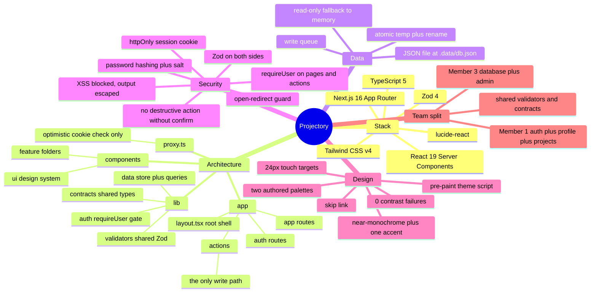

# Projectory — Architecture Mind Map

> A map of the whole thing, for explaining it. The ASCII version below is the
> one that always renders; the Mermaid version at the bottom can be pasted into
> mermaid.live, GitHub, or VS Code's preview for a drawn diagram.

---

## 1. The map (ASCII — always renders)

```
                        PROJECTORY
              a place to publish what you build
                            │
        ┌───────────────────┼───────────────────┐
        │                   │                   │
   THE STACK            THE LAYERS          THE DATA
        │                   │                   │
   ┌────┴────┐         ┌────┴────┐         ┌────┴────┐
Next.js 16   React 19   proxy.ts    app/      JSON file
TypeScript 5 Tailwind 4   ↓         layout.tsx  .data/db.json
Zod 4       lucide      cookie     ↓             ↓
        │               check   app/(auth)   read + write
   App Router                           │         │
   Server Actions                  app/(app)   queue
   19 commits                            │      atomic write
   50 source files                        ↓          │
   ~5,100 lines                    app/actions        │
                                     ↓               │
                            Server Actions           │
                            = the ONLY               │
                              write path             │
                                                     │
        ┌────────────────────┬───────────────────────┼──────────────┐
        │                    │                       │              │
   VALIDATION            AUTH                    UI            ACCESSIBILITY
        │                    │                       │              │
   lib/validators/      lib/auth/              components/      skip link
   project.ts          mode.ts                 ├ ui/           aria-describedby
   auth/schemas.ts     service.ts              ├ auth/         24px touch targets
        │              session.ts              ├ dashboard/    focus visible
   ONE schema          index.ts                ├ nav/          dialog focus trap
   used by BOTH        requireUser()            ├ profile/      0 contrast failures
   browser + server         │                   └ project/
        │                    │                        │
   Why: browser &       Why: every page        Why: one design
   server can never     and every action       system, reused
   disagree             re-checks who you are        │
                                                 Why: no light/dark
  File breakdown:                                  filter — two real
                                                 authored palettes
  app/(routes)   16 files    991 lines
  components     18 files  2,474 lines
  lib            11 files  1,230 lines
  app/actions     3 files    305 lines
  config          4 files     97 lines
```

---

## 2. Layer by layer — what each folder is for

```
projectory/
│
├── proxy.ts ──────────── the front door
│     Checks the session cookie before a page even renders.
│     Deliberately only OPTIMISTIC — it trusts the cookie is there,
│     never that it is valid. Why? Because trying to be clever here
│     caused an ERR_TOO_MANY_REDIRECTS loop with stale cookies.
│     Real validation happens in requireUser().
│
├── app/
│   │
│   ├── layout.tsx ─────── runs for EVERY page
│   │     • loads Inter + JetBrains Mono
│   │     • <ThemeScript>  — applies dark mode BEFORE first paint,
│   │       otherwise dark-mode visitors get a white flash
│   │     • the skip link
│   │
│   ├── (auth)/  ────────── sign-in, sign-up
│   │     layout.tsx bounces anyone already signed in to /dashboard
│   │
│   ├── (app)/  ─────────── everything behind the login
│   │     layout.tsx holds the nav bar + <main id="main">
│   │     dashboard/          list, create, edit, error, loading, not-found
│   │     settings/           profile form + account + sign out
│   │
│   ├── actions/ ────────── Server Actions = the only write path
│   │     auth.ts      sign in / sign up / sign out
│   │     projects.ts  create / update / delete
│   │     profile.ts   update profile
│   │
│   ├── terms/  privacy/   real pages (they were 404s at first)
│   └── globals.css ────── ALL the design tokens live here
│         @theme inline  →  maps --pj-* onto Tailwind's --color-*
│         :root          →  the light palette
│         [data-theme=dark] → the dark palette
│
├── lib/
│   │
│   ├── validators/
│   │     project.ts  ── title/description/tags/URL rules
│   │     (auth/schemas.ts lives under lib/auth/)
│   │       ★ ONE schema, imported by BOTH the browser form and the
│   │         server action. The team plan requires this so the two
│   │         can never drift apart.
│   │
│   ├── data/
│   │     store.ts   ── reads/writes .data/db.json
│   │       • a queue, so two writes never overlap
│   │       • atomic write (temp file + rename)
│   │       • last-known-good snapshot if a read fails
│   │       • falls back to in-memory when the disk is read-only
│   │         (so it still runs on a serverless host)
│   │     projects.ts, profile.ts  ── the actual queries
│   │
│   ├── auth/
│   │     mode.ts      ── detects Clerk keys → flips authMode
│   │     service.ts   ── local username/password provider
│   │     session.ts   ── cookie read/write
│   │     schemas.ts   ── sign-in / sign-up validation
│   │     index.ts     ── requireUser()  ← THE GATE
│   │
│   ├── contracts/types.ts ── the single definition of Project
│   │     ★ deliberately co-owned: Member 3 re-exports this rather
│   │       than redefining it, so the DB layer and the app agree.
│   │
│   └── utils.ts ── tiny helpers (cn, relativeTime)
│
└── components/
      ui/         button, input, Field, Chip, Alert, theme toggle
      auth/       sign-in-form, sign-up-form, providers
      dashboard/  project-list, stat-tiles, status-filter, empty state
      project/    project-form, tag-input, delete dialog, form section
      profile/    profile-form, account section
      nav/        app-nav
```

---

## 3. The data flow of one action (e.g. "Create project")

This is the single most useful thing to be able to draw on a whiteboard.

```
   you type a title and press "Create project"
                    │
                    ▼
   ┌──────────────────────────────────────────┐
   │ 1. BROWSER                             │
   │    react-hook-form runs the SAME Zod     │
   │    schema on blur → instant feedback,   │
   │    no round trip                       │
   └──────────────────┬───────────────────────┘
                      │  <form action={serverAction}>
                      ▼
   ┌──────────────────────────────────────────┐
   │ 2. SERVER ACTION  (app/actions/)        │
   │    requireUser()  ← who are you?         │
   │    parseOrFieldErrors(schema, input)     │
   │      fails → return fieldErrors,         │
   │              nothing is written          │
   └──────────────────┬───────────────────────┘
                      │  valid
                      ▼
   ┌──────────────────────────────────────────┐
   │ 3. DATA LAYER  (lib/data/)              │
   │    withDb(mutator)                      │
   │      • joins the queue                  │
   │      • reads the store                  │
   │      • mutator adds the row             │
   │      • atomic write back to disk        │
   └──────────────────┬───────────────────────┘
                      ▼
   ┌──────────────────────────────────────────┐
   │ 4. BACK TO THE BROWSER                 │
   │    redirect('/dashboard') + revalidate  │
   └──────────────────────────────────────────┘

   Nothing outside app/actions/ ever writes.
   That is the whole security story in one sentence.
```

---

## 4. The bugs I found and fixed (best material for a viva)

| # | Bug | Why it mattered | Fix |
|---|---|---|---|
| 1 | **Database wiped itself on every write** | The log showed the recovery path firing 15× in a row, each replacing real data with demo data. Two causes: reads bypassed the write queue, and `writeFile` truncates before writing so a read could see half a file | Atomic write (temp + `rename`), reads join the queue, last-known-good fallback instead of destroying data |
| 2 | **Password could leak into the URL** | A `<form>` with no `action` defaults to **GET**. Submitting before hydration gave `/sign-in?email=…&password=…` → the password in the address bar, history and proxy logs | Every form now carries its Server Action as `action` |
| 3 | **Pasted emails rejected** | `z.email().trim().toLowerCase()` looks like it normalises. It doesn't — in Zod 4 the format check runs *first*, so trim only sees input that already passed | Normalise first, then validate |
| 4 | **Error messages invisible to screen readers** | `role="alert"` fired once, but the input had no `aria-describedby`, so focusing it said nothing. And the obvious `cloneElement` fix silently does nothing through react-hook-form's `<Controller>` | A small context carries the message id through `<Controller>` |
| 5 | **No skip link** | Every page repeated the full header before its content | Added, with the two details that make one actually work |
| 6 | **Two tap targets under 24px** | Back-links were 20px tall; the tag input was a 20px strip in a 40px field | Padded with negative margin so spacing didn't shift |

---

## 5. Things I checked and found *correct* (worth saying out loud)

Proving something is fine is real work — it is not the absence of work.

- Sorting: edited the oldest project → moved to top of "Recently updated", stayed last under "Newest first". The two are genuinely different.
- Contrast: 0 WCAG AA failures across 16 states (both themes × 7 routes + errored form + dialog).
- XSS: a canary payload with ``, `<script>`, `<svg onload>` stored on 3 surfaces and re-read — nothing fired, no injected nodes, every payload survived as data.
- Concurrency: 40 simultaneous writes + 200 simultaneous reads → 40/40 persisted, 0 lost, 0 re-seeds. 3 tabs saving the profile at once settled on one coherent value.
- Write authorisation: replayed the owner's action id from a different session → the record came back byte-identical.
- Double-submit: `dblclick` on Create produces exactly one project.

---

## 6. Mermaid source

Paste into **mermaid.live**, a GitHub README, or VS Code (Markdown Preview
Mermaid Support) to get a drawn diagram.



---

*Every number in this document was read from the repository, not estimated.
Source: `git ls-files`, line counts, and `package.json`.*